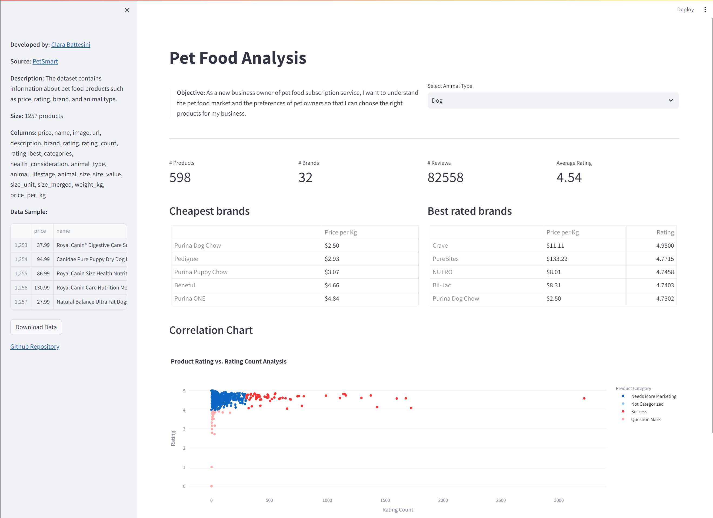

# Pet Food Advice Scraper

This project is a web scraper that collects pet food information to create a database of pet food products.



## Modules

- **Scraper**: The scrapper module is responsible for collecting the data from the website. It uses the `requests` and `beautifulsoup4` libraries to parse the HTML and extract the information.
- **app**: The app module is responsible for the interface. It uses the `streamlit` library to create a web interface to interact with the data.
- **utils**: The utils module contains helper functions to be used across the project.

## Features

### Scraper

- **URL Collector**: The scrapper collects the URLs of the products from the website's paginated list and saves them to a json file.

- **Product Fetch**: The scrapper collects the information from the product's page and saves it to a csv file with the following columns:
  - price
  - name
  - image
  - url
  - description
  - brand
  - rating
  - rating_count
  - rating_best
  - categories
  - heath_consideration
  - animal_type
  - animal_lifestage
  - animal_size
  - size_merged

## Environment Setup

This project uses [Poetry](https://python-poetry.org/) for dependency management.

**[Install Poetry following their documentation.](https://python-poetry.org/docs/#installation)**

Once Poetry is installed, make sure to configure it to create virtual environments within the project's directory:

> This is a recommended setting so it will be easier to delete the virtual environment if needed.

```bash
poetry config virtualenvs.in-project true
```

Install the dependencies using:

```bash
poetry install
```

This will install the dependencies and create a virtual environment for the project.

## Usage

### Scrapper

To activate the virtual environment, use:

```bash
poetry shell
```

To control and specific parts of the project, call the desired functions at `main.py` and use to run:

```bash
poetry run python main.py
```

This will run the main.py script within the project's virtual environment.

### Interface

To activate the virtual environment, use:

```bash
poetry shell
```

To run the interface with streamlit, use:

```bash
streamlit run app.py
```
